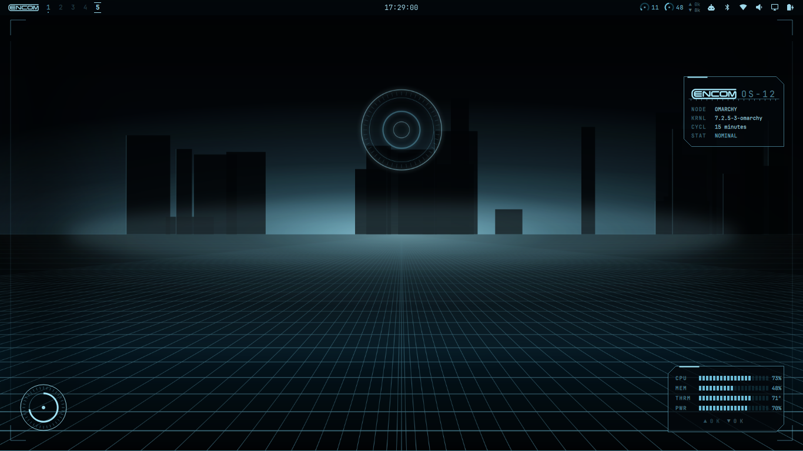
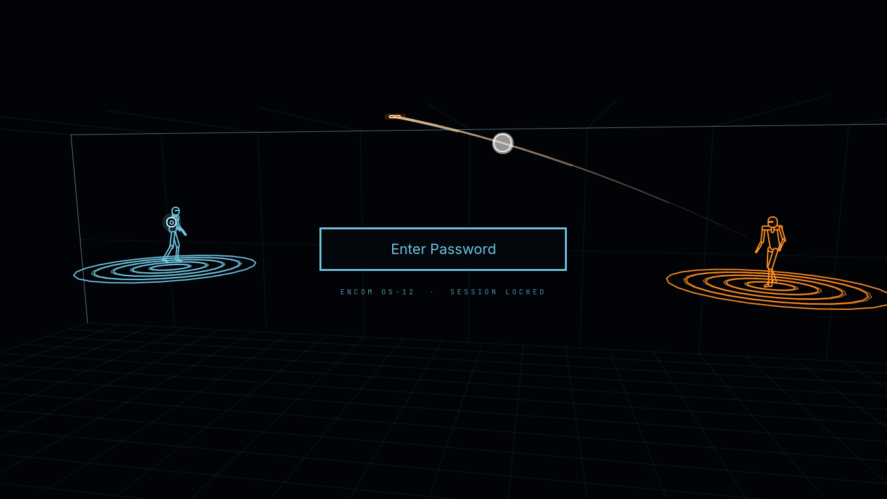
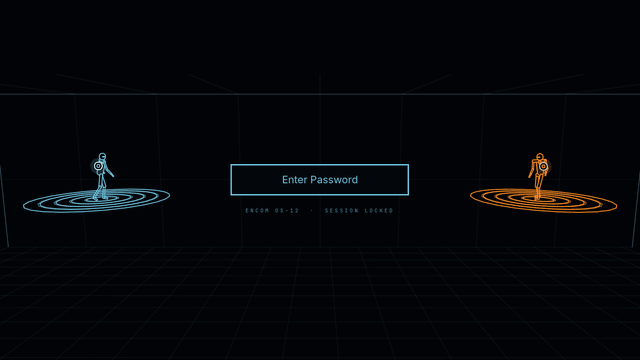
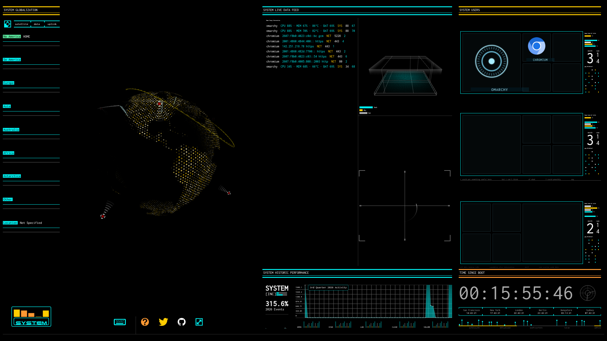
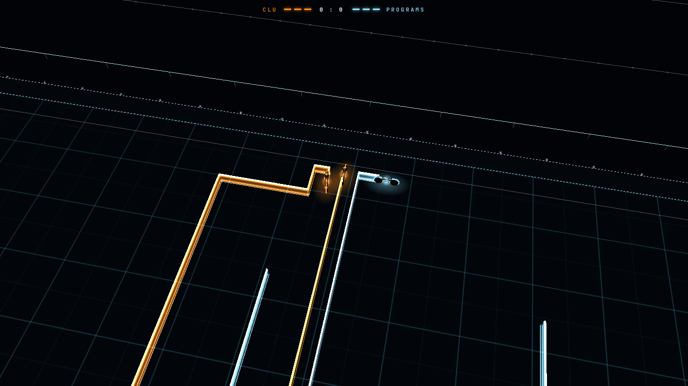
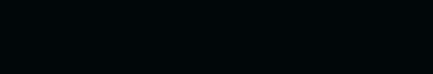
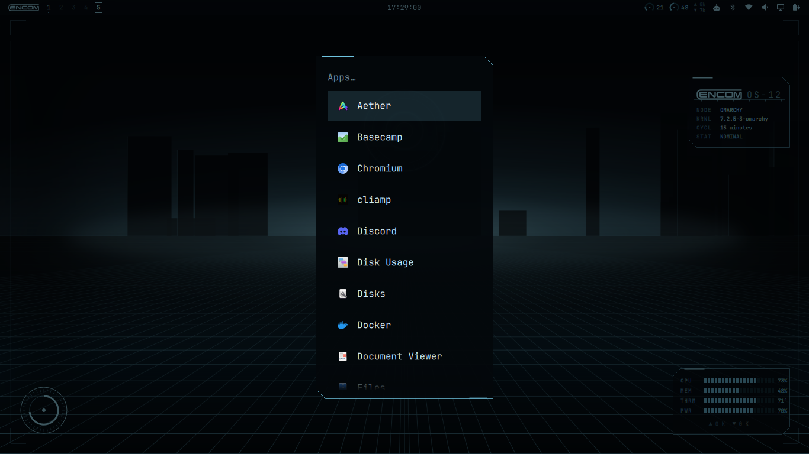
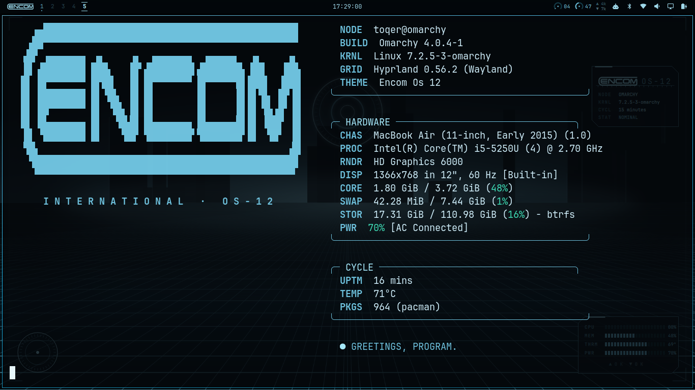
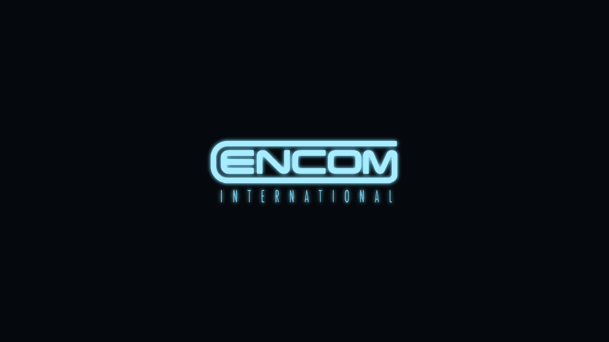

# ENCOM OS-12 for Omarchy

A *Tron: Legacy* desktop for [Omarchy](https://omarchy.org): the ENCOM OS-12 look, from the boot splash to the screensaver, built as a working desktop rather than just a wallpaper.



## What you get

**The look**
- A full Omarchy theme: black glass, Tron cyan, Clu-orange for alarms. Terminals, btop, editors and the shell all pick it up.
- Three generated wallpapers (grid horizon, circuit board, sea of simulation).
- The ENCOM International logo on the bar, the HUD, the terminal and the boot splash.
- Square window corners and windows that *rez* in and *derezz* out.
- The **Encom-Cyan** cursor: Adwaita's shapes, recoloured with a soft cyan halo.
- Translucent terminals over the grid, and an ENCOM fastfetch readout.

**The disc wars lock screen**: behind the password field, two original fighters, a teal program and an orange sentinel, duel with identity discs on concentric ring platforms high above the arena floor.





- The fighters move with real motion capture (a frisbee throw, a stance and a sidestep from the CMU database), with blocks, flips, dodges and falls built on top of it.
- Throws are blocked on the defender's own disc, held like a shield in one hand or both. Sometimes they're dodged instead: a sidestep or a side flip, twist or backflip onto another ring, or a duck, sweep kick or split jump in place. Now and then one connects, knocking the fighter back a ring, or three times in ten derezzing them: their outline shatters into a hundred glowing pieces that tumble down to the arena floor.
- Discs banked off the ceiling knock out rings. A fighter who loses their footing clings to the next ring's edge, and sometimes climbs back up; otherwise the next shot sends them falling into the void. The rings rise again and the duel goes on.
- It's all drawn with plain QtQuick shapes through a hand-projected 3D camera. No Qt Quick 3D, no web view, no real lights.
- It's Omarchy's own lock with one scene added. The password and fingerprint handling are left exactly as Omarchy ships them. An installed post-update hook refreshes the clone from Omarchy's lock after every update. If the scene no longer fits, it switches back to Omarchy's own lock rather than run an out-of-date one.

**The HUD** — etched onto the desktop, below your windows:
- Chamfered console panels: system ident, live CPU / memory / temperature / battery meters, and an identity disc that tracks CPU load.
- A system-check boot cascade each time the shell starts.
- Workspace nodes and ENCOM gauges on the bar, and a chamfered launcher.

**The live Boardroom wallpaper**: the boardroom projection from the film as your desktop background, running as a live monitor of this machine:



- It fills the whole screen at any size. The layout keeps the width-fit scale and grows taller into the spare height; the globe, the 3D cube, the dial, the charts and the icon frames keep their shapes, and a third row of icon frames appears when there's room.

- **SYSTEM**: real events from this computer. New network connections are pinned on the globe using an offline IP database, so no address ever leaves the machine. Windows opening, journal warnings, logins, package changes, devices and periodic system samples all appear too, each with its program's icon.
- **GITHUB**: the original 2013 replay.
- **WIKIPEDIA**: live edits from around the world, pinned by language edition.
- On the desktop it shows SYSTEM. It animates only while the desktop is actually visible (an empty workspace), you're on mains power, and the screen is on and unlocked. The rest of the time it holds its last frame and uses next to no CPU. The HUD steps aside while it runs.
- It needs `gtk-layer-shell`, which the installer adds.

**The Light Cycles screensaver**: after 150 s idle, a three-on-three light cycle match in the *Tron: Legacy* arena, Clu's orange riders against the programs:



- All six cycles are AI-driven. For each possible move, the AI measures how much of the arena it could still reach, so it doesn't wind itself into dead ends. Once trapped in a pocket, it hugs the walls to make the space last. With room to spare, it hunts, cutting across the nearest enemy's path. A derezzed rider's ribbon fades and frees its space, as in the film.
- Each side has one **champion** (the longer bar on the scoreboard). Near an enemy, it searches a few moves ahead for both riders (minimax with alpha-beta pruning), scoring positions by territory: the cells it can reach before anyone else. Once walled off, it fills its remaining space as efficiently as it can. In 100 simulated rounds, champions outlasted both teammates 56% of the time, against 40% with the search switched off.
- A scoreboard shows each side's riders still in play and the rounds won. A new round starts a few seconds after one side is wiped out.
- One overhead camera follows the closest duel. It pans, zooms and slowly turns to keep that duel in frame, staying close enough that the cycles are clearly visible. Each cycle also carries a glow marker that keeps the same size on screen.
- The film's look: glossy black cycles with glowing wheel rings and body lines, Clu orange against program blue-white. Light ribbons are bright at the top and bottom edges and see-through in the middle. The arena is a dark grid inside stands drawn in bluish-white vector outlines, with rows of lamps and floodlight towers.
- None of those glows are real light sources. They're textures, lines and sprites, which keeps the Broadwell GPU's load down.
- Silent. It closes on any key or mouse movement, and the screen still locks on schedule behind it.
- Prefer the Boardroom as the screensaver? Set `"screensaver": "boardroom"` (see below). It then rotates through SYSTEM, GITHUB and WIKIPEDIA.

**Alerts**: disk nearly full, sustained heat, low battery, memory pressure, failed services and out-of-memory kills. They show in ENCOM teal: a **!** on the bar (visible over windows), a SYSTEM ALERT panel on the HUD, and in the Boardroom a SYSTEM ALERT box with an animated comms portrait, Star Fox style.



*An incoming alert (simulated): the comms window opens, then the message slides out beside it.*

| | |
|---|---|
|  |  |
|  | |

## Install

Needs Omarchy 4.x with Chromium. On a stock install every other dependency is already present, except two small cursor-building tools, which the installer offers to add.

```bash
git clone https://github.com/RobertMCortese/omarchy-encom-os-12
cd omarchy-encom-os-12
./install.sh
```

- `./install.sh --dry-run` shows every step without changing anything.
- It asks before installing the boot splash, which needs sudo and rebuilds the initramfs. `--no-plymouth` skips it.
- Every file it replaces is backed up to `~/.local/state/omarchy-encom-os-12/`, and running it again is safe.
- `omarchy update` can reset the boot splash; an installed post-update hook puts it back.

**Uninstall:** `./uninstall.sh` (also has `--dry-run`).

## Configure

`~/.config/encom-boardroom/config.json`:

| Key | Default | |
|---|---|---|
| `screensaver` | `"lightcycles"` | Which screensaver runs on idle: `"lightcycles"` or `"boardroom"` |
| `home` | Los Angeles | Where this machine sits on the globe: `{"name", "lat", "lon"}` |
| `cycle` | `["system", "github", "wikipedia"]` | Boardroom screensaver rotation |
| `cycle_seconds` | `120` | Time on each |
| `alerts` | see file | Thresholds: disk %, CPU °C, battery %, memory, swap |

- **Screensaver timeout:** Omarchy's own `idle.screensaver` in `~/.config/omarchy/shell.json`.
- **Turn the ENCOM screensaver off:** `omarchy-toggle encom-screensaver-off`, which gives you no screensaver. To get Omarchy's own back, also run `omarchy toggle screensaver`.
- **Run a screensaver now:** `encom-screensaver lightcycles` or `encom-screensaver boardroom`.
- **Live wallpaper:** `encom-wallpaper on | off | toggle | status`. Install with `--no-wallpaper` to start with it off.
- **Open the Boardroom as a window:** `encom-boardroom`.

## How it fits together

| Path | What |
|---|---|
| `theme/encom-os-12/` | The Omarchy theme, logo (+ ASCII generator) and boot art |
| `hud/` | Quickshell service plugin: HUD panels, alerts, idle trigger |
| `bar/` | Bar widgets and the telemetry probe |
| `shell/` | Workspace nodes, and the patch that chamfers Omarchy's launcher |
| `lock/` | The disc wars scene, its baked motion capture (`poses.js`), and the patch that adds it to a clone of Omarchy's lock |
| `boardroom/` | Monitor server, alert checks, icon resolver, the layer-shell wallpaper and its services, and `patch.py`, which rebuilds the upstream app |
| `lightcycles/` | The 3-on-3 game: engine, AI, camera and scoreboard (`encom-game.js`), cycles and stadium (`encom-arena.js`), and the pinned three.js version |
| `hypr/`, `terminal/`, `fastfetch/`, `cursor/` | Look'n'feel pieces |
| `tools/` | How the logo was traced, and how the lock screen's motion capture was baked |

Notes for anyone hacking on it:
- The HUD is a `service` plugin, so edits to it need `omarchy restart shell`.
- The wallpaper is two user services: `encom-boardroom-server` (the monitor on port 8741) and `encom-wallpaper` (a WebKitGTK view on the layer shell's bottom layer). Logs are in `journalctl --user -u encom-wallpaper`.
- The launcher is a clone of Omarchy's menu. After an Omarchy update to the menu, re-run the installer to re-clone and re-patch it.

## Credits

This stands on other people's work. Thank you:

- **[Rob Scanlon (@arscan)](https://github.com/arscan)** built the **[ENCOM Boardroom](https://www.robscanlon.com/encom-boardroom/)**, the HTML5/WebGL recreation of the *Tron: Legacy* boardroom scene that the screensaver runs on ([source](https://github.com/arscan/encom-boardroom), MIT). The installer fetches his original at a pinned revision and patches it locally. His globe library, [encom-globe](https://github.com/arscan/encom-globe), is part of it. The in-app readme still credits him, as it should.
- **[Erich Loftis (@erichlof)](https://github.com/erichlof)** wrote **[3dLightCycles](https://github.com/erichlof/3dLightCycles)** (CC0, public domain), the three.js light cycle game the screensaver started from. The 3-on-3 version is a new engine written for this project, inspired by his.
- **[three.js](https://threejs.org)** (MIT) renders the Light Cycles arena. The installer downloads r71 from npm and verifies its checksum.
- **[Omarchy](https://omarchy.org)** by DHH and contributors: the desktop all of this is built on, and the code the workspace and launcher clones start from.
- **[DB-IP](https://db-ip.com)**: IP to City Lite database, [CC BY 4.0](https://creativecommons.org/licenses/by/4.0/). The installer downloads it.
- **[GNOME Adwaita](https://gitlab.gnome.org/GNOME/adwaita-icon-theme)**: the cursor shapes Encom-Cyan is recoloured from.
- **[Wikimedia EventStreams](https://stream.wikimedia.org)**: the live Wikipedia feed.
- **[Tron wiki](https://tron.fandom.com/wiki/ENCOM)**: the reference image the ENCOM logo was traced from.

*Tron*, *Tron: Legacy* and **ENCOM** are trademarks of Disney. This is an unofficial fan project, not affiliated with or endorsed by Disney. See [CREDITS.md](CREDITS.md) for licences.

## License

The code in this repository is MIT ([LICENSE](LICENSE)). That covers our own work only; third-party pieces keep their own licences, listed in [CREDITS.md](CREDITS.md).
