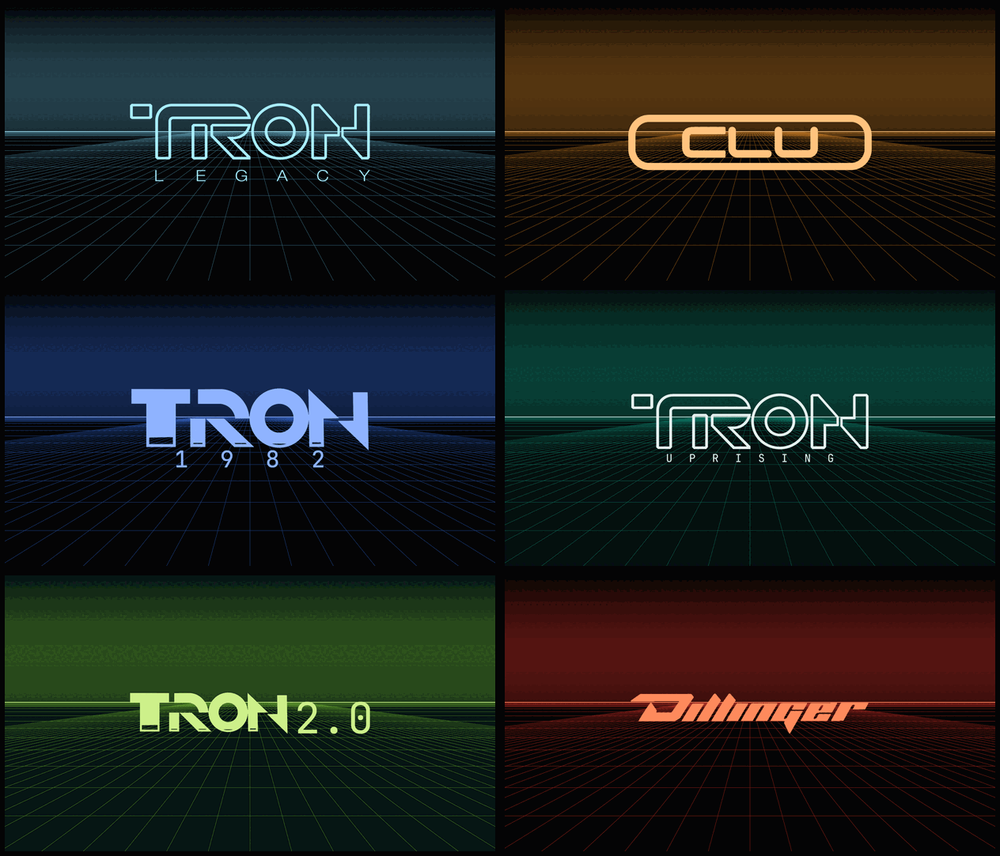
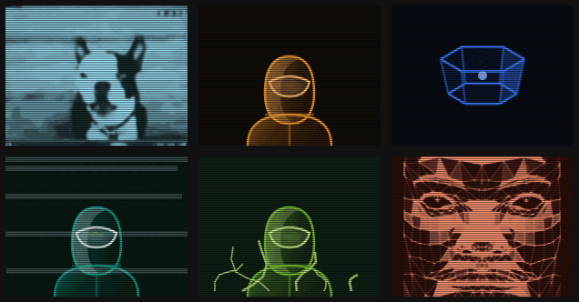
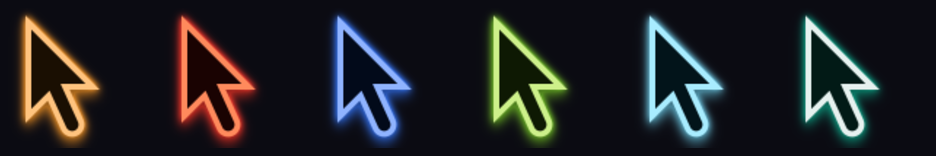
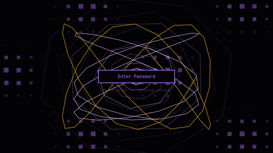

# ENCOM OS-12 for Omarchy

A *Tron: Legacy* desktop for [Omarchy](https://omarchy.org): the ENCOM OS-12 look, from the boot splash to the screensaver, built as a working desktop rather than just a wallpaper. It comes in six themes — TRON Legacy cyan, CLU orange, TRON 1982 electric blue, TRON Uprising jade, TRON 2.0 corruption green and Dillinger Systems red.


## What you get

**The look**
- A full Omarchy theme: black glass, Tron cyan, Clu-orange for alarms. Terminals, btop, editors and the shell all pick it up. Five more themes come with it ([below](#six-themes)).
- Three generated wallpapers (grid horizon, circuit board, sea of simulation).
- The ENCOM International logo on the bar, the HUD, the terminal and the boot splash.
- Square window corners and windows that *rez* in and *derezz* out.
- A cursor per theme: Adwaita's shapes recoloured, the body in the theme's bright accent, a soft halo under it and an outline in a dark tint of the same hue. It follows a theme switch, and survives a reboot: the Hyprland config reads the cursor's name out of the current theme's palette rather than carrying one.
- Translucent terminals over the grid, and an ENCOM fastfetch readout.

**The disc wars lock screen**: behind the password field, two original fighters, a teal program and an orange sentinel, duel with identity discs on concentric ring platforms high above the arena floor. (The 1982 theme puts [a different scene](#six-themes) there.)


- The fighters move with real motion capture (a frisbee throw, a stance and a sidestep from the CMU database), with blocks, flips, dodges and falls built on top of it.
- Throws are blocked on the defender's own disc, held like a shield in one hand or both. Sometimes they're dodged instead: a sidestep or a side flip, twist or backflip onto another ring, or a duck, sweep kick or split jump in place. Now and then one connects, knocking the fighter back a ring, or three times in ten derezzing them: their outline shatters into a hundred glowing pieces that tumble down to the arena floor.
- Discs banked off the ceiling knock out rings. A fighter who loses their footing clings to the next ring's edge, and sometimes climbs back up; otherwise the next shot sends them falling into the void. The rings rise again and the duel goes on.
- It's all drawn with plain QtQuick shapes through a hand-projected 3D camera. No Qt Quick 3D, no web view, no real lights.
- It's Omarchy's own lock with one scene added. The password and fingerprint handling are left exactly as Omarchy ships them. An installed post-update hook refreshes the clone from Omarchy's lock after every update. If the scene no longer fits, it switches back to Omarchy's own lock rather than run an out-of-date one.

**The HUD** — etched onto the desktop, below your windows:
- Chamfered console panels: system ident, live CPU / memory / temperature / battery meters, and an identity disc that tracks CPU load.
- A system-check boot cascade each time the shell starts.
- Workspace nodes and ENCOM gauges on the bar, and a chamfered launcher.

**The live Boardroom wallpaper**: the boardroom projection from the film as your desktop background, running as a live monitor of this machine:


- It fills the whole screen at any size. The layout keeps the width-fit scale and grows taller into the spare height; the globe, the 3D cube, the dial, the charts and the icon frames keep their shapes, and a third row of icon frames appears when there's room.

- **SYSTEM**: real events from this computer. New network connections are pinned on the globe using an offline IP database, so no address ever leaves the machine. Windows opening, journal warnings, logins, package changes, devices and periodic system samples all appear too, each with its program's icon.
- **GITHUB**: the original 2013 replay.
- **WIKIPEDIA**: live edits from around the world, pinned by language edition.
- On the desktop it shows SYSTEM. It animates only while the desktop is actually visible (an empty workspace), you're on mains power, and the screen is on and unlocked. The rest of the time it holds its last frame and uses next to no CPU. The HUD steps aside while it runs.
- It needs `gtk-layer-shell`, which the installer adds.

**The Light Cycles screensaver**: after 150 s idle, a three-on-three light cycle match in the *Tron: Legacy* arena, Clu's orange riders against the programs:


- All six cycles are AI-driven. For each possible move, the AI measures how much of the arena it could still reach, so it doesn't wind itself into dead ends. Once trapped in a pocket, it hugs the walls to make the space last. With room to spare, it hunts, cutting across the nearest enemy's path. A derezzed rider's ribbon fades and frees its space, as in the film.
- Each side has one **champion** (the longer bar on the scoreboard). Near an enemy, it searches a few moves ahead for both riders (minimax with alpha-beta pruning), scoring positions by territory: the cells it can reach before anyone else. Once walled off, it fills its remaining space as efficiently as it can. In 100 simulated rounds, champions outlasted both teammates 56% of the time, against 40% with the search switched off.
- A scoreboard shows each side's riders still in play and the rounds won. A new round starts a few seconds after one side is wiped out.
- One overhead camera follows the closest duel. It pans, zooms and slowly turns to keep that duel in frame, staying close enough that the cycles are clearly visible. Each cycle also carries a glow marker that keeps the same size on screen.
- The film's look: glossy black cycles with glowing wheel rings and body lines, Clu orange against program blue-white. Light ribbons are bright at the top and bottom edges and see-through in the middle. The arena is a dark grid inside stands drawn in bluish-white vector outlines, with rows of lamps and floodlight towers.
- None of those glows are real light sources. They're textures, lines and sprites, which keeps the Broadwell GPU's load down.
- Silent. It closes on any key or mouse movement, and the screen still locks on schedule behind it.
- The riders wear the theme's colours; on the 1982 theme they go back to the original arcade game's blue against yellow.
- Prefer another screensaver? Set `"screensaver": "boardroom"` (see below), which rotates through SYSTEM, GITHUB and WIKIPEDIA, or `"discwars"` for the disc duel.

**The Disc Wars screensaver**: the lock screen's duel, full screen — and up to three on a side. The same fighters, rings and throws (blocked on the shield, dodged with a flip or a sweep kick, banked off the ceiling to take a ring out from under someone), but with the password field gone and nothing else on the screen. It runs on a canvas rather than in QML (`discwars/`, also published on its own at [encom-disc-wars](https://github.com/RobertMCortese/encom-disc-wars)), takes its colours from the current theme, and closes on any input.

- `"screensaver": "discwars"` turns it on; `"discwars_teams"` picks the match — `1` for the duel, `2` or `3` for two ranks of platforms facing each other across the arena.
- In a team match each fighter still has its own platform and four rings, and as many exchanges run at once as there are fighters on a side, so a 3v3 keeps three discs in the air. Fighters mostly stay on the opponent they are fighting, gang up on one that has been knocked off and is hanging from an edge, and now and then switch targets.
- A scoreboard across the top carries each side's name, a pip per fighter that goes dark as it is knocked out, and the rounds won; the side that clears the board is named under it. It stays up as a screensaver, where the rest of the chrome does not — who is still standing is the scene rather than furniture.
- Once a teammate is out its platform stands empty, and the survivors can dodge **across onto it** — a longer, higher jump to the next platform along the rank, never onto the other side's and never onto one somebody is already standing on. So the ranks thin out and spread, and being outnumbered is more survivable than it looks.
- **A fighter that goes over the edge is out for the round.** Nobody comes back until one side has been cleared off the board entirely; then every ring rises, both teams rez in and the next round starts. So a match is a war of attrition — 3v3 down through 3v1 to a win, and now and then a clean sweep with nobody lost.
- A broken ring rises again on its own after a while, so a match left running for hours never grinds every platform down to nothing.
- The camera pulls back for a bigger match and drifts toward whichever exchange is in the air. The 1v1 keeps the fixed framing it was composed around.

**Alerts**: disk nearly full, sustained heat, low battery, memory pressure, failed services and out-of-memory kills. They show in the theme's alert colour, ENCOM teal as standard: a **!** on the bar (visible over windows), a SYSTEM ALERT panel on the HUD, and in the Boardroom a SYSTEM ALERT box with an animated comms portrait, Star Fox style.


*An incoming alert (simulated): the comms window opens, then the message slides out beside it.*

| | |
|---|---|
|  |  |
|  | |

## Six themes

The same desktop comes in six colours. Everything above follows the one you pick: the terminal and editor palettes, the wallpapers, the logo, the boot splash, the HUD and bar, the alerts and their portrait, the light cycles, the lock screen and the Boardroom projection.



And the face on the comms window, which every theme has: drawn from code in that theme's own
colour, lit from one side, with the picture interlaced and a band rolling down it. Two are
footage rather than drawings — Marv on TRON Legacy and the MCP on Dillinger — pulled open for
contrast and put through the same ramp, so they sit on the same screen as the rest.



Even the pointer: one cursor per theme, built from Adwaita's geometry.



| Theme | | The sides |
|---|---|---|
| **TRON Legacy** | Tron cyan, Clu orange for alarms | PROGRAMS vs CLU |
| **CLU** | Clu's orange, cyan for alarms | CLU vs PROGRAMS |
| **Dillinger Systems** | Dillinger red over black, ice-blue alarms, and its own wordmark in place of ENCOM's | DILLINGER vs ENCOM |
| **TRON 1982** | The first film: electric blue (`#3b7bff`) and amber | USERS vs PROGRAMS |
| **TRON Uprising** | The series between the films: jade (`#11a389`), a cool white highlight and rust alarms | RENEGADE vs OCCUPATION |
| **TRON 2.0** | The 2003 game: the Corruption's chartreuse (`#79c72f`) over a dark teal system, firewall orange for alarms | USER vs CORRUPTION |

Switch with Omarchy's own theme menu, where they're listed as *Tron Legacy*, *Clu*, *Dillinger Systems* and *Tron 1982*, or with `omarchy theme set "Tron Legacy"`. Nothing needs rebuilding: every piece reads the current theme's `encom.json` and repaints itself. The Boardroom is recoloured in the browser as it loads: every cyan in it turns the theme's accent and every amber the theme's second colour, each keeping its own lightness so the layout stays readable. Where a theme's accent is a colour the projection already used, the two swap places rather than collapse into one.

TRON 2.0's green is the Corruption — the infection spreading over Monolith's clean geometry, `#43691c` to `#72ad34` in a frame of it, against a system that measures `#062727` to `#0b4549`. It is the one hue in the wheel none of the films use: Legacy sits at 195°, Uprising 168°, 1982 220°, CLU 35°, Dillinger 5°, and the Corruption at 85°.

Uprising's jade is the series': a frame of it measures `#0a6658` to `#11a389` in the field, with the Renegade in `#e6f1ef` white and the occupation's circuitry in rust — so it is the one theme whose highlight is a white rather than a tint of its own colour, and the one whose sides are a white against a warm rather than two colours opposed.

The 1982 blue is the film's own: its wordmark is a `#1688b9` gradient and the transfer sequence peaks around `#3b70f6`, so the theme runs on the blue the original game's cycles were drawn in.

**TRON 1982 goes further.** The light cycles go back to the original game's blue against yellow, and to the pieces that came with the game this screensaver started from: its arena wall panels, its classic cycle model and its light trails, in place of our Legacy-era ones. (One palette key, `classic`, turns all three on.)

And the password screen is a different scene: not the disc duel but **the transfer**, our own recreation of the ride from the real world into the game world that the first film opens the grid with. Five movements on a 64-second loop, all wireframe, all generated:

1. **The kaleidoscope** — a field of short lines reflected across a grid of mirrors, folding into a new pattern as it drifts, working through teal, red, pale violet, purple and blue
2. **The tunnel** — rings of a polygon, each turned further than the last, flown down the middle of a curving path the camera banks into; grid-ruled tetromino plates tumble past and it ends on nested square frames
3. **The field** — the port opens onto sheets of board stacked one behind another, flown through: traces, dot rows, dot matrix, vias and beads of light running along tracks, the camera panning and spinning
4. **The arrival** — high over a triangulated world with those same plates floating as clouds and red beams standing off the dark cities; down through them, over ground that rises and falls, in towards the one green beam
5. **The C** — a city of extruded blocks with canyons between them around the structure that throws the beam; the camera locks onto it, tips down as it passes over, and goes out through a green kaleidoscope that hands back to the first movement

The 3D is hand-rolled — a camera basis, a perspective divide and near-plane clipping — because the flat vector look wants nothing more. Every edge is one plain QtQuick rectangle from a fixed pool, so a frame costs the same whatever is on screen, and it runs at 30 fps, as its source did at 24.



Making your own is a script: colours in, theme out.

```bash
tools/make-theme.py                 # rebuild all variants from theme/encom-os-12
tools/make-portrait.py encom-ares   # redraw one theme's alert portrait
```

Each theme's card and boot splash carry the name of the thing — the two films' wordmarks, CLU lettered in ENCOM's own face, Dillinger's traced from its reference — over a grid drawn in that theme's colour. The bar and HUD keep ENCOM's mark on the ENCOM themes; only Dillinger replaces it, since only Dillinger is a different house.

`make-theme.py` holds a small table of target colours per theme and restyles the base theme's files into new ones, generating the wallpapers, the logo, the boot art, the preview and the palette. A theme can bring its own wordmark instead of ENCOM's — Dillinger Systems does — and every theme keeps it at `logo/mark.svg`, which the bar, the HUD and the terminal readout all read from the current theme, so the mark follows a theme switch. Each palette carries `lockScene` (`duel` or `digitise`), `portrait` (which portrait is drawn: `sentinel`, `glitch` or `polyhedron`) and the two sides' names and colours. `make-portrait.py` draws the portrait as SVG frames and assembles the GIF; a theme whose `portrait` is `own` keeps the `theme/<name>/portrait.gif` it ships instead, which is how Dillinger Systems gets the Master Control Program.

## Install

Needs Omarchy 4.x with Chromium. On a stock install every other dependency is already present, except two small cursor-building tools, which the installer offers to add.

```bash
git clone https://github.com/RobertMCortese/omarchy-encom-os-12
cd omarchy-encom-os-12
./install.sh
```

- `./install.sh --dry-run` shows every step without changing anything.
- It asks before installing the boot splash, which needs sudo and rebuilds the initramfs. `--no-plymouth` skips it.
- Every file it replaces is backed up to `~/.local/state/omarchy-encom-os-12/`, and running it again is safe.
- `omarchy update` can reset the boot splash; an installed post-update hook puts it back.

**Uninstall:** `./uninstall.sh` (also has `--dry-run`).

## Configure

`~/.config/encom-boardroom/config.json`:

| Key | Default | |
|---|---|---|
| `screensaver` | `"lightcycles"` | Which screensaver runs on idle: `"lightcycles"` or `"boardroom"` |
| `home` | Los Angeles | Where this machine sits on the globe: `{"name", "lat", "lon"}` |
| `cycle` | `["system", "github", "wikipedia"]` | Boardroom screensaver rotation |
| `cycle_seconds` | `120` | Time on each |
| `alerts` | see file | Thresholds: disk %, CPU °C, battery %, memory, swap |
| `lock_blank_seconds` | not set | How long the lock screen stays lit with no input before the display blanks. Unset keeps Omarchy's 5 seconds. After changing it, run `python3 ~/.config/omarchy/plugins/$USER.lock/encom-lock-patch.py` and `omarchy restart shell` |

- **Screensaver timeout:** Omarchy's own `idle.screensaver` in `~/.config/omarchy/shell.json`.
- **Turn the ENCOM screensaver off:** `omarchy-toggle encom-screensaver-off`, which gives you no screensaver. To get Omarchy's own back, also run `omarchy toggle screensaver`.
- **Run a screensaver now:** `encom-screensaver lightcycles` or `encom-screensaver boardroom`.
- **Live wallpaper:** `encom-wallpaper on | off | toggle | status`. Install with `--no-wallpaper` to start with it off.
- **Open the Boardroom as a window:** `encom-boardroom`.
- **Boot splash:** `encom-splash` puts the current theme's mark on the boot screen and the disk unlock prompt. Those live in the initramfs, so a theme switch can't repaint them on its own — it needs sudo and a rebuild, which is why it's a command rather than automatic. An installed post-update hook keeps it in place afterwards.

## How it fits together

| Path | What |
|---|---|
| `theme/tron-legacy/` | The base theme, logo (+ ASCII generator) and boot art. Each theme also carries `encom.json`, the palette every piece here reads |
| `theme/clu/`, `dillinger-systems/`, `tron-1982/` | The three variants, generated by `tools/make-theme.py` |
| `hud/` | Quickshell service plugin: HUD panels, alerts, idle trigger |
| `bar/` | Bar widgets and the telemetry probe |
| `shell/` | Workspace nodes, and the patch that chamfers Omarchy's launcher |
| `lock/` | The disc wars scene, the 1982 digitiser (`Digitize.qml`), the baked motion capture (`poses.js`), and the patch that adds the theme's scene to a clone of Omarchy's lock |
| `boardroom/` | Monitor server, alert checks, icon resolver, the layer-shell wallpaper and its services, and `patch.py`, which rebuilds the upstream app |
| `lightcycles/` | The 3-on-3 game: engine, AI, camera and scoreboard (`encom-game.js`), cycles and stadium (`encom-arena.js`), the pinned three.js version, and the original game's arena walls, cycle model and trail (CC0) for the 1982 theme |
| `hypr/`, `terminal/`, `fastfetch/`, `cursor/` | Look'n'feel pieces |
| `tools/` | The theme and portrait generators, how the logo was traced, and how the lock screen's motion capture was baked |

Notes for anyone hacking on it:
- The HUD is a `service` plugin, so edits to it need `omarchy restart shell`.
- The wallpaper is two user services: `encom-boardroom-server` (the monitor on port 8741) and `encom-wallpaper` (a WebKitGTK view on the layer shell's bottom layer). Logs are in `journalctl --user -u encom-wallpaper`.
- The launcher is a clone of Omarchy's menu. After an Omarchy update to the menu, re-run the installer to re-clone and re-patch it.

## Credits

This stands on other people's work. Thank you:

- **[Rob Scanlon (@arscan)](https://github.com/arscan)** built the **[ENCOM Boardroom](https://www.robscanlon.com/encom-boardroom/)**, the HTML5/WebGL recreation of the *Tron: Legacy* boardroom scene that the screensaver runs on ([source](https://github.com/arscan/encom-boardroom), MIT). The installer fetches his original at a pinned revision and patches it locally. His globe library, [encom-globe](https://github.com/arscan/encom-globe), is part of it. The in-app readme still credits him, as it should.
- **[Erich Loftis (@erichlof)](https://github.com/erichlof)** wrote **[3dLightCycles](https://github.com/erichlof/3dLightCycles)** (CC0, public domain), the three.js light cycle game the screensaver started from. The 3-on-3 version is a new engine written for this project, inspired by his.
- **[three.js](https://threejs.org)** (MIT) renders the Light Cycles arena. The installer downloads r71 from npm and verifies its checksum.
- **[Omarchy](https://omarchy.org)** by DHH and contributors: the desktop all of this is built on, and the code the workspace and launcher clones start from.
- **[DB-IP](https://db-ip.com)**: IP to City Lite database, [CC BY 4.0](https://creativecommons.org/licenses/by/4.0/). The installer downloads it.
- **[GNOME Adwaita](https://gitlab.gnome.org/GNOME/adwaita-icon-theme)**: the cursor shapes Encom-Cyan is recoloured from.
- **[Wikimedia EventStreams](https://stream.wikimedia.org)**: the live Wikipedia feed.
- **[Tron wiki](https://tron.fandom.com/wiki/ENCOM)**: the reference images the ENCOM and [Dillinger Systems](https://tron.fandom.com/wiki/Dillinger_Systems) logos were traced from.

*Tron*, *Tron: Legacy* and **ENCOM** are trademarks of Disney. This is an unofficial fan project, not affiliated with or endorsed by Disney. See [CREDITS.md](CREDITS.md) for licences.

## License

The code in this repository is MIT ([LICENSE](LICENSE)). That covers our own work only; third-party pieces keep their own licences, listed in [CREDITS.md](CREDITS.md).
